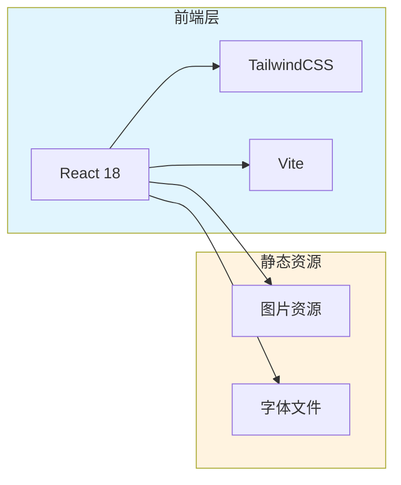
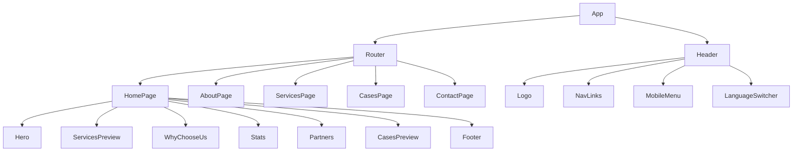

# IT服务公司网站 技术架构文档

## 1. 架构设计

### 1.1 系统架构图


### 1.2 技术栈
- **前端框架**：React 18
- **构建工具**：Vite 5
- **样式方案**：TailwindCSS 3
- **国际化**：react-i18next（完整的i18n解决方案）
- **动画库**：Framer Motion（可选，轻量级用CSS）
- **图标库**：Lucide React / Heroicons
- **字体**：Google Fonts（思源黑体备选）

## 2. 路由定义

### 2.1 页面路由
| 路由路径 | 页面名称 | 描述 |
|---------|---------|------|
| / | 首页 | 品牌展示、核心服务、案例展示 |
| /about | 关于我们 | 企业介绍、团队展示 |
| /services | 服务内容 | 服务项目详细 |
| /cases | 案例中心 | 客户案例展示 |
| /contact | 联系我们 | 联系方式表单 |

### 2.2 导航结构
```
导航栏
├── 首页 (/)
├── 关于我们 (/about)
├── 服务内容 (/services)
├── 案例中心 (/cases)
└── 联系我们 (/contact)
```

## 3. 组件架构

### 3.1 组件树


### 3.2 核心组件
- **Header**：固定顶部导航栏，包含Logo、导航链接、移动端菜单、语言切换
- **LanguageSwitcher**：中英文切换按钮，显示当前语言，切换时全站内容更新
- **Hero**：全屏首屏区域，背景、标题、CTA
- **ServiceCard**：服务展示卡片，图标、标题、描述
- **StatsCounter**：数据统计展示，支持数字动画
- **CaseCard**：案例展示卡片，图片、标题、描述
- **Footer**：底部导航，包含联系方式、快速链接
- **ContactForm**：联系表单组件

## 4. 数据模型

### 4.1 静态数据
由于是展示型网站，使用本地JSON数据，支持双语：

```typescript
// 服务数据（双语）
interface Service {
  id: string;
  icon: string;
  title: {
    zh: string;
    en: string;
  };
  description: {
    zh: string;
    en: string;
  };
}

// 案例数据（双语）
interface Case {
  id: string;
  title: {
    zh: string;
    en: string;
  };
  description: {
    zh: string;
    en: string;
  };
  image: string;
  tags: {
    zh: string[];
    en: string[];
  };
}

// 统计数据（双语）
interface Stat {
  value: number;
  label: {
    zh: string;
    en: string;
  };
  suffix?: string;
}

// 团队成员（双语）
interface TeamMember {
  name: string;
  role: {
    zh: string;
    en: string;
  };
  avatar: string;
}
```

### 4.2 模拟数据文件
- `/src/locales/zh.json`：中文翻译文件
- `/src/locales/en.json`：英文翻译文件
- `/data/services.json`：服务项目数据（双语）
- `/data/cases.json`：案例数据（双语）
- `/data/team.json`：团队成员数据（双语）
- `/data/partners.json`：合作伙伴数据

## 5. 目录结构

```
/workspace/
├── index.html
├── package.json
├── vite.config.js
├── tailwind.config.js
├── postcss.config.js
├── src/
│   ├── main.jsx
│   ├── App.jsx
│   ├── index.css
│   ├── i18n.js
│   ├── locales/
│   │   ├── zh.json
│   │   └── en.json
│   ├── components/
│   │   ├── Header.jsx
│   │   ├── Footer.jsx
│   │   ├── Hero.jsx
│   │   ├── ServiceCard.jsx
│   │   ├── StatsCounter.jsx
│   │   ├── CaseCard.jsx
│   │   ├── LanguageSwitcher.jsx
│   │   └── ContactForm.jsx
│   ├── pages/
│   │   ├── HomePage.jsx
│   │   ├── AboutPage.jsx
│   │   ├── ServicesPage.jsx
│   │   ├── CasesPage.jsx
│   │   └── ContactPage.jsx
│   ├── data/
│   │   ├── services.json
│   │   ├── cases.json
│   │   ├── team.json
│   │   └── partners.json
│   └── assets/
│       └── images/
└── public/
    └── images/
```

## 6. 性能优化

### 6.1 优化策略
- 图片懒加载
- 组件代码分割
- CSS动画优先（减少JS负担）
- TailwindCSS purge（移除未使用样式）
- 资源压缩

### 6.2 响应式断点
```javascript
screens: {
  'sm': '640px',
  'md': '768px',
  'lg': '1024px',
  'xl': '1280px',
  '2xl': '1536px',
}
```

## 7. 可访问性

- 语义化HTML标签
- 适当的ARIA标签
- 键盘导航支持
- 足够的颜色对比度
- 焦点状态样式

## 8. 浏览器支持

- Chrome/Edge（最新2个版本）
- Firefox（最新2个版本）
- Safari（最新2个版本）
- 移动端Safari/Chrome
