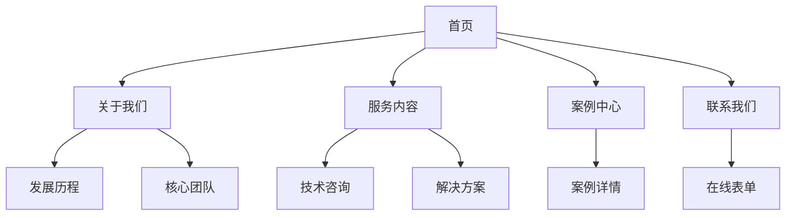

# IT服务公司网站 PRD

## 1. 产品概述
打造一个具有国际大公司风范的IT服务公司官方网站，展示企业专业形象与服务能力。网站采用简洁明快的设计风格，内容以中文为主，融入本地化元素，旨在建立客户信任，提升品牌认知度。

**目标用户**：潜在企业客户、合作伙伴、技术人才
**核心价值**：传递专业、可信赖、创新的企业形象

## 2. 核心功能

### 2.1 页面结构
1. **首页 (Home)**：品牌展示、核心服务、核心优势、合作伙伴、客户案例、联系入口
2. **关于我们 (About)**：企业简介、发展历程、核心团队、企业文化
3. **服务内容 (Services)**：服务项目详细展示、技术能力、解决方案
4. **案例中心 (Cases)**：成功案例展示、行业解决方案
5. **联系我们 (Contact)**：联系方式、在线咨询、地址地图

### 2.2 首页模块详情
| 模块名称 | 功能描述 |
|---------|---------|
| 导航栏 | 固定顶部，响应式汉堡菜单 |
| Hero区域 | 全屏视觉冲击，企业slogan，CTA按钮 |
| 服务概览 | 三大核心服务卡片展示 |
| 为什么选择我们 | 4-6个核心优势亮点 |
| 数据统计 | 项目数、客户数、技术人员数等 |
| 合作伙伴 | logo墙展示 |
| 客户案例 | 精选案例轮播/网格展示 |
| 底部导航 | 联系方式、快速链接、社交媒体 |

### 2.3 全局功能
- 响应式设计（桌面、平板、手机）
- 平滑滚动导航
- 数字动画效果
- 悬停交互动效
- 国际化准备（预留中英文切换）

## 3. 核心流程

### 3.1 用户浏览流程
```
用户访问 → 首页展示 → 了解服务 → 查看案例 → 联系咨询
```

### 3.2 导航流程图


## 4. 用户界面设计

### 4.1 设计风格
**风格定位**：国际大公司风格 - 简洁、专业、现代

**色彩方案**：
- 主色：深蓝色 #1E3A5F（传递专业、信任）
- 辅色：科技蓝 #3B82F6（现代、科技感）
- 强调色：活力橙 #F97316（活力、行动）
- 背景色：纯白 #FFFFFF、浅灰 #F8FAFC
- 文字色：深灰 #1E293B、中灰 #64748B

**字体选择**：
- 标题：思源黑体（Source Han Sans）/ 无衬线几何字体
- 正文：系统默认无衬线字体栈
- 英文：Inter / SF Pro Display

**布局方式**：
- 网格系统：12列布局
- 间距规范：8px基准单位
- 卡片设计：圆角矩形，轻微阴影
- 图标风格：线性图标，简洁风格

**动效设计**：
- 页面加载：渐入动画，staggered reveal
- 滚动触发：fade-up, scale-in
- 悬停效果：subtle scale, color transition
- 数字统计：count-up动画

### 4.2 页面详细设计

#### 首页 Hero区域
- 全屏高度
- 背景：渐变色或抽象几何图形
- 标题：超大字号，48-64px
- 副标题：简洁的价值主张
- CTA按钮：填充主色，hover变亮

#### 服务卡片
- 白色背景，圆角16px
- 图标：48px，主题色
- 标题：20px，粗体
- 描述：简洁文字，2-3行
- Hover：轻微上浮，阴影加深

#### 数据统计
- 大字号数字：48-72px
- 单位/标签：14px
- 数字动画：滚动时触发

### 4.3 响应式策略
- 桌面优先（1440px设计基准）
- 平板适配（768px断点）
- 手机适配（480px断点）
- 图片：响应式srcset
- 导航：桌面横向 → 移动端汉堡菜单

### 4.4 本地化设计
- 中文为主要内容语言
- 中国特色图标元素（可选）
- 本地化支付/联系方式展示
- 符合中国用户习惯的交互设计
