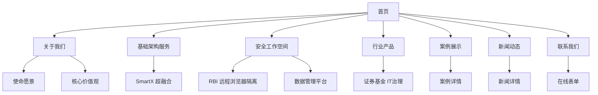

# IT服务公司网站 PRD

## 1. 产品概述
打造一个具有国际大公司风范的IT服务公司官方网站，展示企业专业形象与核心产品能力。网站采用简洁明快的设计风格，支持中英文双语切换，内容本地化与国际化并重，旨在建立金融行业客户信任，提升品牌认知度。

**公司名称**：[待定]

**目标用户**：证券基金等金融行业客户、潜在企业客户、合作伙伴
**核心价值**：传递专业、可信赖、创新的企业形象

## 2. 核心功能

### 2.1 页面结构
1. **首页 (Home)**：公司介绍、三大核心业务展示、优势亮点、客户案例、新闻动态、联系入口
2. **关于我们 (About)**：公司使命愿景、核心价值观、联系方式
3. **基础架构服务 (Infrastructure)**：SmartX 超融合解决方案详细介绍
4. **安全工作空间 (Security)**：RBI 远程浏览器隔离 + 数据管理平台详细介绍
5. **行业产品 (Products)**：证券基金 IT 治理数字化产品详细介绍
6. **案例展示 (Cases)**：成功案例展示、行业解决方案
7. **新闻动态 (News)**：公司新闻、行业资讯、技术文章
8. **联系我们 (Contact)**：联系方式、在线咨询表单

### 2.2 首页模块详情
| 模块名称 | 功能描述 |
|---------|---------|
| 导航栏 | 固定顶部，响应式菜单，包含所有主要导航项 |
| Hero区域 | 全屏视觉冲击，公司slogan，三大核心业务入口 |
| 三大核心业务 | 基础架构、安全工作空间、行业产品卡片展示 |
| 核心优势 | 4-6个核心优势亮点展示 |
| 新闻动态 | 最新公司新闻和行业资讯展示 |
| 客户案例 | 精选案例展示 |
| 底部导航 | 联系方式、快速链接、社交媒体 |

### 2.3 全局功能
- **中英文切换**：语言切换按钮，一键切换全站语言，内容实时更新，无需刷新页面
- 响应式设计（桌面、平板、手机）
- 平滑滚动导航
- 数字动画效果
- 悬停交互动效

## 3. 核心流程

### 3.1 用户浏览流程
```
用户访问 → 首页展示 → 了解核心业务 → 查看案例 → 阅读新闻 → 联系咨询
```

### 3.2 导航流程图


## 4. 用户界面设计

### 4.1 设计风格
**风格定位**：国际大公司风格 - 简洁、专业、现代

**色彩方案**：
- 主色：深蓝色 #1E3A5F（传递专业、信任）
- 辅色：科技蓝 #3B82F6（现代、科技感）
- 强调色：活力橙 #F97316（活力、行动）
- 背景色：纯白 #FFFFFF、浅灰 #F8FAFC
- 文字色：深灰 #1E293B、中灰 #64748B

**字体选择**：
- 标题：Inter / 无衬线几何字体
- 正文：系统默认无衬线字体栈

**布局方式**：
- 网格系统：12列布局
- 间距规范：8px基准单位
- 卡片设计：圆角矩形，轻微阴影
- 图标风格：线性图标，简洁风格

**动效设计**：
- 页面加载：渐入动画，staggered reveal
- 滚动触发：fade-up, scale-in
- 悬停效果：subtle scale, color transition
- 数字统计：count-up动画

### 4.2 页面详细设计

#### 首页 Hero区域
- 全屏高度
- 背景：渐变色或抽象几何图形
- 标题：超大字号，48-64px
- 副标题：简洁的价值主张
- CTA按钮：填充主色，hover变亮
- 三大核心业务快速入口

#### 核心业务卡片
- 白色背景，圆角16px
- 图标：48px，主题色
- 标题：20px，粗体
- 描述：简洁文字，2-3行
- Hover：轻微上浮，阴影加深
- 可点击跳转详情页

#### 客户案例
- 卡片网格展示
- 行业标签
- 简洁描述
- 点击查看详情

#### 新闻动态
- 时间轴或卡片列表展示
- 分类标签（公司新闻、行业资讯、技术文章）
- 点击查看详情

### 4.3 响应式策略
- 桌面优先（1440px设计基准）
- 平板适配（768px断点）
- 手机适配（480px断点）
- 图片：响应式srcset
- 导航：桌面横向 → 移动端汉堡菜单

### 4.4 本地化与国际化设计
- **双语支持**：中英文内容完整切换，默认显示中文
- 语言切换器：导航栏显眼位置，显示当前语言状态
- 中文内容：本地化表达，符合中国用户习惯
- 英文内容：专业、地道的国际化表达
- 联系方式：中国本地化（电话、邮箱、地址）
- 响应式布局：双语内容均保持良好的可读性和视觉效果

### 4.5 产品详情页设计

#### SmartX 超融合解决方案
- Hero区域：产品名称和 tagline
- 产品介绍：详细描述产品功能和优势
- 核心功能：列表展示主要功能点
- 应用场景：典型使用场景展示
- 技术规格：技术参数和规格
- CTA：联系咨询按钮

#### RBI 远程浏览器隔离 + 数据管理平台
- Hero区域：产品名称和 tagline
- 产品介绍：详细描述产品功能和优势
- RBI功能：远程浏览器隔离技术详解
- 数据管理：数据管理平台功能详解
- 核心优势：产品优势列表
- 适用场景：典型使用场景展示
- CTA：联系咨询按钮

#### 证券基金 IT治理数字化产品
- Hero区域：产品名称和 tagline
- 行业背景：证券基金行业特点
- 产品功能：IT治理各模块功能详解
- 核心价值：产品为客户创造的价值
- 成功案例：行业客户案例展示
- CTA：联系咨询按钮
